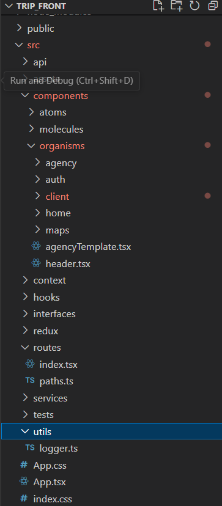

[![Contributors][contributors-shield]][contributors-url]
[![Forks][forks-shield]][forks-url]
[![Stargazers][stars-shield]][stars-url]
[![Issues][issues-shield]][issues-url]
[![MIT License][license-shield]][license-url]
[![LinkedIn][linkedin-shield]][linkedin-url]

<!-- PROJECT LOGO -->
<br />
<div align="center">
  <a href="https://github.com/othneildrew/Best-README-Template">
    
  </a>

  <h3 align="center">TRIP-APPLICATION</h3>
  <p align="center">
    You work for a travel agency. You are responsible for creating an application that allows
users to see details of their upcoming trip, using a GraphQL API like
intermediary for multiple REST APIs.
    <br />
    <a href="https://github.com/Firastrabelsi94/Trip-Application-Frontend/blob/TripBranch/README.md"><strong>Explore the docs »</strong></a>
    <br />
    <br />
    <a href="LINK TO YOUTUBE">View Demo</a>
    ·
    <a href="https://github.com/Firastrabelsi94/Trip-Application-Frontend/issues/new">Report Bug</a>
    ·
    <a href="https://github.com/Firastrabelsi94/Trip-Application-Frontend">Request Contributor access</a>
  </p>
</div>

<!-- TABLE OF CONTENTS -->
<details>
  <summary>Table of Contents</summary>
  <ol>
    <li>
      <a href="#about-the-project">About The Project</a>
      <ul>
        <li><a href="#built-with">Built With</a></li>
      </ul>
    </li>
    <li>
      <a href="#getting-started">Getting Started</a>
      <ul>
        <li><a href="#prerequisites">Prerequisites</a></li>
        <li><a href="#installation">Installation</a></li>
      </ul>
    </li>
    <li><a href="#usage">Usage</a></li>
    <li><a href="#roadmap">Perspectives</a></li>
    <li><a href="#contributing">Contributing</a></li>
    <li><a href="#contact">Contact</a></li>
  </ol>
</details>

<!-- ABOUT THE PROJECT -->

## About The Project

<style>
.container {
  display: grid;
 align-items: left; 
 grid-template-columns: 0.2fr 1fr 1fr;
 column-gap: 15px;
}
img {
  max-width: 100%;
  max-height:100%;
}

.text {
  font-size: 14px;
}
</style>

 <div class="container">
      <div class="image">
<a href="http://localhost:3000"></a>
      </div>
      <div class="text">
Whenever one starts to explore places around the globe, one of the most exciting places to visit is the continent of Africa/Europe/Asia. There is so much unexplored beauty in Africa for example and other countries like the coasts of South Africa, the untamed fields of savannah and other monuments located in the Egypt. So, to Start Travel Agency Business in Africa will be an amazing idea and one must pursue this thought. With us, we can make it easy for you, by just some clicks you can book all your needs to meet the luxury and the comfort during your visit.
  </div>
</div>
  
<br/>
* Create new Travel file according your choice by including Flights or Hotel roms and even both <br/>
* We offer the possibility to book also in same file for your involved parties (Fellow Travellers)<br/>
* Paiement can be done via Stripe in security (Feature onGoing)<br/>

Of course, this MVP version is not supporting all features, still proof of concept and then can be enhanced with more features. Your satisfaction is our target.

<p align="right">(<a href="#readme-top">back to top</a>)</p>

### Built With

<hr/>
This section should list any major frameworks/libraries used to create our project from Dev/Design and Deploy perspective.

- [![React][React.js]][React-url]
- [![Atomic][Atomic.js]][Atomic-url]
- [![Sonar][Sonar.js]][Sonar-url]
- [![DotNet][.dotnet.js]][.DotNet-url]
- [![DotNet][Material.js]][Material-url]
- [![Sonar][Docker.js]][Docker-url]
- [![SQLite][SQLite.js]][SQLite-url]
- [![layers][Layers.js]][Layers-url]
- [![Vite][Vite.js]][Vite-url]

<p align="right">(<a href="#readme-top">back to top</a>)</p>

<h3><b><p style="color:#003791">FRONT-END PART</p></b></h3>
<!-- GETTING STARTED -->
## Getting Started

This Fontend project has been built with React library following the Atomic design pattern, I tried to cover some components with unit Testing approach based on Jest/Enzyme.
I am using here the functional component and not class component strategy.
I did a static code analysis for our code to ensure that I haven't technical debt in the developed application as shown below :

### Prerequisites

<hr/>

<p>1. npm

```sh
npm install npm@latest -g
```

  </p>
<p>2. Node: Node.js (Node) is an Open Source, cross-platform runtime environment for executing JavaScript code. Node is used extensively for server-side programming, making it possible for developers to use JavaScript for client-side and server-side code without needing to learn an additional language. </br>
Vite requires Node.js version >=14.18.0, so please ensure to have Node version greater than 14.18 (Better to have v16)</br>

```sh
  node -v
```

</p>

<p>* Vite: ite is a JS bundler. Vite takes your React JSX code and transforms it into raw HTML, CSS, and JS files that can be run by most browsers. Those files are then hosted and served to end users.</p>

<p>* React: React is a JavaScript library for building user interfaces (UI)</p>

### Installation

<hr/>
<p>_Below is an example of how you can instruct your audience on installing and setting up your app. This template doesn't rely on any external dependencies or services._</p>

<p>1. Run SonarQube
 First open windows services from Start Menu => Run => ServicesMsc, Search for Docker and right click then Start. After that go to application terminal and Built the image and wait Sonar to finalize the analysis.

```sh
docker compose up
```

Once analysis finalized, open this link in your browser: http://localhost:9000

  </p>

1. Get a free API Key at [https://example.com](https://example.com)
2. Clone the repo

```sh
   git clone https://github.com/your_username_/Project-Name.git
```

3. Install NPM packages

```sh
   npm install
```

4. Enter your API in `config.js`

```js
const API_KEY = "ENTER YOUR API";
```

5. Build images using docker:

```sh
   docker build . -t "trip_front:v1.0"
```

6. We can now check the list of available docker images on our local system by running the following command:

```sh
   docker images
```

7. Let’s now try running this image; which is now called a container. Run the following command to spin up a container based on the image "trip_front:v1.0"

```sh
   docker run -p 8080:8080 "trip_front:v1.0"
```

<p align="right">(<a href="#readme-top">back to top</a>)</p>

<!-- USAGE EXAMPLES -->

## Usage

0. Project Structure:<br/>
   

1. Login Page: http://localhost:8080/login
   You can follow this link to login to your space as client in the application or Register by clicking on the "register" button if you visit the application for the first time. We are offering also Mode Light and Mode Dark and you can change it based on the top right toggle button, same for the language, our application support 2 languages 'Fr' and 'En'</br>
   

2. Register Page: http://localhost:8080/register
   You can follow this link to be able to create new account as client in the agency and then login to start consulting offers, hotels, flight and book your needs to create your travel file.<br/>
   

3. List of hotels in the agency: http://localhost:8080/client/home
   You can access to the list of hotels with their information by clicking on the button "Explore Hotels", then a popup with Carousel will be displayed.<br/>
   

4. Create new travel file: http://localhost:8080/client/book
   You can access to the link above to be able as client to consult list of hotels/flights and create new file for travel or hosting.</br>
   Step1: Choose the right hotel.<br/>
   <br/>
   Step2: Add needed rooms for client and for fellow travellers.<br/>
   <br/>
   Step3: Choose the right fligh (Optional step)<br/>
   <br/>

5. Find my reservations: http://localhost:8080/client/home
   You can access to the link above to be able to consult your reservations (Created Files containing flights/hotels), to get the right data, you need to fill-in your first and last name.</br>
   <br/>

<p align="right">(<a href="#readme-top">back to top</a>)</p>

<!-- Code EXAMPLES -->

## Front Code Samples

0. Models/Interfaces:<br/>
   Let's first understand the difference between entities and models in front. Well, entities are for capturing data from the database, and that’s their concern, whereas models are for the front-end and contain all the cumulative information that a user might want. Models may ignore some data from an entity and include many entities or may even be exactly the same as the entity itself. Either way remember this: models represent our front-end concerns, entities represent our database concerns.<br/>
   <br/>
   <br/>
1. Atomic Design (Atoms & Molecules & Organisms):<br/>
   In the natural world, atomic elements combine together to form molecules. These molecules can combine further to form relatively complex organisms. To expound a bit further:<br/>

- Atoms are the basic building blocks of all matter. Each chemical element has distinct properties, and they can’t be broken down further without losing their meaning. (Yes, it’s true atoms are composed of even smaller bits like protons, electrons, and neutrons, but atoms are the smallest functional unit.)
  <br/>
  <br/>
- Molecules are groups of two or more atoms held together by chemical bonds. These combinations of atoms take on their own unique properties, and become more tangible and operational than atoms.
  <br/>
  <br/>
- Organisms are assemblies of molecules functioning together as a unit. These relatively complex structures can range from single-celled organisms all the way up to incredibly sophisticated organisms like human beings.. In our case, it represent our created components using Atoms and Molecules.<br/>
<br/>
2. Services: They are the responsible to call backend RestApis/GraphQL in order to retrieve data for specific entities or to save an entity in our database.<br/>
<br/>
2. Hooks: Instead, Hooks provide a more direct API for React concepts you already know: props, local state, context, refs, and lifecycle. It will be used in our case to get data from the services and then pass it to the component to be displayed in the client side<br/>
<br/>


<!-- ROADMAP -->

## Roadmap

- [Done] Add Changelog
- [Done] Add back to top links
- [Done] Create needed pages
- [In Progress] Integrate all pages with Backend
- [Done] Multi-language Support in the application
- [Done] Unit test implementation
- [Done] Integrate Dockerization and SonarQube
- [Open] Api and integration in front for saving the created file in database (Time constraint)

<p align="right">(<a href="#readme-top">back to top</a>)</p>

<!-- CONTRIBUTING -->

## Contributing

Contributions are what make this application such an amazing place to learn, inspire, and create. Any contributions you make are **greatly appreciated**.

If you have a suggestion that would make this better, please fork the repo and create a pull request. You can also simply open an issue with the tag "enhancement".
Don't forget to give the project a star if you like the idea (Draft App)! Thanks again!

1. Fork the Project
2. Create your Feature Branch (`git checkout -b feature/AmazingFeature`)
3. Commit your Changes (`git add .` then `git commit -m 'Add some AmazingFeature'`)
4. Push to the Branch (`git push origin feature/AmazingFeature`)
5. Open a Pull Request to the master branch

<p align="right">(<a href="#readme-top">back to top</a>)</p>

<!-- LICENSE -->

## License

Distributed under the MIT License. Developed for external client on behalf of CoConsult.

<p align="right">(<a href="#readme-top">back to top</a>)</p>

<!-- CONTACT -->

## Contact

Firas Trabelsi - [@your_twitter](https://twitter.com/your_username) - email@example.com

<p align="right">(<a href="#readme-top">back to top</a>)</p>

<!-- MARKDOWN LINKS & IMAGES -->

[contributors-shield]: https://img.shields.io/github/contributors/Firastrabelsi94/Trip-Application-Frontend.svg?style=for-the-badge
[contributors-url]: https://github.com/Firastrabelsi94/Trip-Application-Frontend/graphs/contributors
[forks-shield]: https://img.shields.io/github/forks/Firastrabelsi94/Trip-Application-Frontend.svg?style=for-the-badge
[forks-url]: https://github.com/Firastrabelsi94/Trip-Application-Frontend/network/members
[stars-shield]: https://img.shields.io/github/stars/Firastrabelsi94/Trip-Application-Frontend.svg?style=for-the-badge
[stars-url]: https://github.com/Firastrabelsi94/Trip-Application-Frontend/stargazers
[issues-shield]: https://img.shields.io/github/issues/Firastrabelsi94/Trip-Application-Frontend.svg?style=for-the-badge
[issues-url]: https://github.com/Firastrabelsi94/Trip-Application-Frontend/issues
[license-shield]: https://img.shields.io/github/license/Firastrabelsi94/Trip-Application-Frontend.svg?style=for-the-badge
[license-url]: https://github.com/Firastrabelsi94/Trip-Application-Frontend/blob/master/LICENSE.txt
[linkedin-shield]: https://img.shields.io/badge/-LinkedIn-black.svg?style=for-the-badge&logo=linkedin&colorB=555
[linkedin-url]: https://linkedin.com/in/Firastrabelsi94
[product-screenshot]: src/assets/trip.png
[React.js]: https://img.shields.io/badge/React-20232A?style=for-the-badge&logo=react&logoColor=61DAFB
[React-url]: https://reactjs.org/
[Atomic.js]: https://img.shields.io/badge/Atomic%20Design-0769AD?style=for-the-badge&logo=fujitsu&logoColor=%23ffffff&color=orange
[Atomic-url]: https://atomicdesign.bradfrost.com/table-of-contents/
[Sonar.js]: https://img.shields.io/sonar/coverage/swellaby%3Aletra?server=https%3A%2F%2Fsonarcloud.io&style=for-the-badge&logo=sonarqube&label=SonarQube&color=red
[Sonar-url]: http://sonarqube:9000
[.DotNet.js]: https://img.shields.io/badge/.NET%20Core-0769AD?style=for-the-badge&logo=dotnet&logoColor=%23ffffff
[.DotNet-url]: https://dotnet.microsoft.com/en-us/
[Material.js]: https://img.shields.io/badge/MaterialUI-0769AD?style=for-the-badge&logo=mui&logoColor=white&color=%232ECCAA
[Material-url]: https://mui.com/
[Docker.js]: https://img.shields.io/badge/Docker-0769AD?style=for-the-badge&logo=docker&logoColor=%23ffffff&color=purple
[Docker-url]: https://www.docker.com/
[SQLite.js]: https://img.shields.io/badge/SQLite-0769AD?style=for-the-badge&logo=sqlite&logoColor=%23ffffff&color=back
[SQLite-url]: https://www.sqlite.org/
[Layers.js]: https://img.shields.io/badge/3%20Layers%20Arch-0769AD?style=for-the-badge&logo=clarifai&logoColor=%23ffffff&color=pink
[Layers-url]: https://medium.com/@deanrubin/the-three-layered-architecture-fe30cb0e4a6
[Vite.js]: https://img.shields.io/badge/Vite-0769AD?style=for-the-badge&logo=vite&logoColor=%23ffffff&color=%23B3382C
[Vite-url]: https://vitejs.dev/
